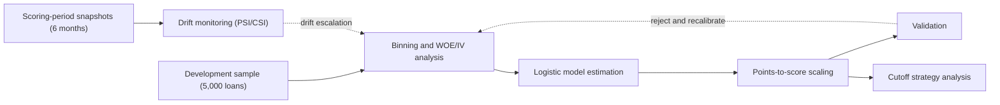
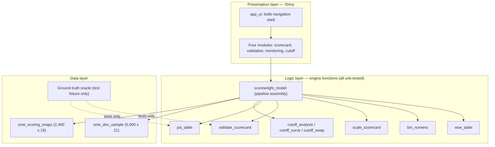

# Scorewright

Scorewright is an R package and Shiny application for developing credit scorecards for SME lending. It covers the full scorecard workflow: characteristic binning, weight-of-evidence (WOE) analysis, logistic model estimation, points-to-score scaling, validation, drift monitoring, and cutoff strategy analysis.

---

## Overview

Credit scorecards remain the dominant modelling approach in SME lending. They are transparent, auditable, robust on small structured datasets, and acceptable to regulators in ways that black-box methods often are not. Scorewright implements the complete lifecycle of a scorecard — not only model fitting, but the surrounding discipline that production credit risk practice requires: characteristic binning, weight-of-evidence transformation, score scaling, validation, drift monitoring, and cutoff strategy analysis.

The development sample is synthetic with documented ground truth: a data generator encodes a known signal spectrum, informative missingness mechanisms, an acceptance screen, and pre-registered population drift. Every methodology module is therefore verified against ground truth it could not see at development time — including a blind drift-detection test in which the monitoring module recovered the injected drift without access to the drift flags.


---

## Verification Results

| Verification | Result |
|---|---|
| IV ranking vs designed signal spectrum | 4/4 strong predictors ranked top-4; all 5 designed nulls in the bottom five |
| Scaling reconstruction (points-sum vs linear-predictor routes) | max difference 2.3e-13 |
| Discrimination vs oracle ceiling | Gini 0.563 vs ceiling 0.591 (95.3%) |
| Correlation of fitted PD with true PD | 0.871 |
| Blind drift detection | 4/5 fire channels confirmed in all drifted months; tenor partial (1/3, monthly detectability boundary); zero false alarms |
| Score-level masking | max score PSI 0.046 (stable) while CSI fired up to 0.54 on characteristics |
| Cutoff policy trade-off | tighten 456.6 to 558.2: 1,875 goods declined per 295 bads removed (ratio 6.36) |

---

## How the Application Works

The application follows the standard scorecard development sequence. A development sample of accepted applications with observed outcomes is coarse-classed into bins and transformed to weights of evidence, a logistic regression is estimated on the transformed inputs, and the fitted model is mapped onto a fixed score scale through explicit factor/offset arithmetic (600 points at odds 30:1, PDO 40). The resulting scorecard is validated for discrimination and stability, monitored across scoring periods for population drift, and evaluated as a decision tool through cutoff strategy analysis.



The dashed edges are the discipline that separates a production scorecard from a fitted model: validation failure and drift escalation both route back into redevelopment, not into silent deployment. The monitoring module is tested blind — drift ground truth lives in a separate oracle the application cannot read.

---

## Architecture

The application is a `{golem}` package: a thin presentation layer of Shiny modules over a package function layer that implements the methodology, reading from packaged synthetic data. The ground-truth oracle ships as a test fixture, structurally inaccessible to the application.



---

## Application Screenshots


---

## Repository Layout

```
scorewright/
├── R/                # engine functions and Shiny modules
├── data-raw/         # synthetic data generator (one seed, 25+ structural invariants)
├── data/             # packaged datasets (sme_dev_sample, sme_scoring_snaps)
├── inst/testdata/    # ground-truth oracle (test fixture)
├── inst/app/www/     # static assets
├── tests/testthat/   # 225+ assertions from hand-verified worked examples
├── dev/              # golem scripts and live-fire verification scripts
├── DESIGN.md         # decision ledger: postmortems and methodology rationale
└── DESCRIPTION
```

---

## Module Status

| Module | Status |
|--------|--------|
| Data preparation and EDA | Complete (generator with 25+ structural invariants) |
| Binning and WOE/IV analysis | Complete (bin_numeric, woe_table) |
| Model estimation and scaling | Complete (scale_scorecard, two-route exact reconstruction) |
| Model validation | Complete (validate_scorecard, 95% of oracle ceiling) |
| Drift monitoring (PSI/CSI) | Complete (psi_table, blind drift test passed) |
| Cutoff strategy analysis | Complete (cutoff_analysis, dual-policy live fire) |
| Shiny application | Complete (four modules: scorecard, validation, monitoring, cutoff strategy) |
| Deployment | In progress |

Module status is updated in the same commit that delivers the module.

---

## Methodology and Sources

- Siddiqi, N. (2006). *Credit Risk Scorecards: Developing and Implementing Intelligent Credit Scoring Systems.* Wiley.
- Siddiqi, N. (2017). *Intelligent Credit Scoring: Foundations and Developers Guide.* Wiley.
- Thomas, L. C., Edelman, D. B., and Crook, J. N. (2017). *Credit Scoring and Its Applications, 2nd edition.* SIAM.
- Lessmann, S., Baesens, B., Seow, H.-V., and Thomas, L. C. (2015). Benchmarking state-of-the-art classification algorithms for credit scoring. *European Journal of Operational Research, 247(1).*
- Basel Committee on Banking Supervision, working papers on validation, particularly for low-default portfolios.
- Federal Reserve and OCC (2011), Supervisory Guidance on Model Risk Management (SR 11-7), informing the structure of validation and monitoring reporting.

---

## Design Decisions

Key trade-offs and their rationale are recorded in `DESIGN.md`: why WOE binning rather than one-hot encoding, why logistic regression rather than gradient boosting for the primary scorecard, how missing values are handled as informative bins, and a postmortem ledger of nine errors caught by the verification protocol during development.

---

## Known Limitations

- In-sample validation only; out-of-time evaluation awaits matured snapshot outcomes.
- Reject inference is not applied; the development sample contains accepted applications only, with the acceptance screen (compensating-factor DSCR truncation) encoded and documented in the generator.
- Calibration is assessed through decile bad rates rather than formal tests.
- The synthetic generator is documented openly — the blindness that matters is architectural (the monitoring module cannot read the oracle), the same structure a real bank has between a model and its validators.

---

## Running the Application

**Installation from GitHub (requires R 4.1 or later):**

```r
# install.packages("remotes")
remotes::install_github("arponbiswasanik/scorewright")
scorewright::run_app()
```

**Development mode (from a clone of the repository):**

```r
install.packages(c("golem", "shiny", "bslib", "DT"))
# open the cloned repository in RStudio (scorewright.Rproj), then:
golem::run_dev()
```

The application fits the scorecard pipeline at startup, so the first load takes a few seconds. The packaged datasets (`sme_dev_sample`, `sme_scoring_snaps`) ship with the repository, so no data regeneration is needed to run the application. The generator (`data-raw/sme_datagen.R`) is included for full reproducibility of the documented ground truth.
