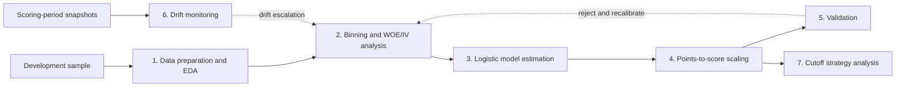
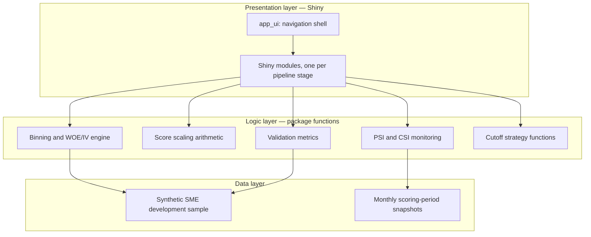

# Scorewright

An SME credit scorecard development, validation, and monitoring studio, built as a production-style Shiny application in R.

---

## Overview

Credit scorecards remain the dominant modelling approach in SME lending. They are transparent, auditable, robust on small structured datasets, and acceptable to regulators in ways that black-box methods often are not. Scorewright implements the complete lifecycle of a scorecard — not only model fitting, but the surrounding discipline that production credit risk practice requires: characteristic binning, weight-of-evidence transformation, score scaling, validation, drift monitoring, and cutoff strategy analysis.

This is a portfolio project built to mirror production methodology (Siddiqi, 2006; Thomas, Edelman and Crook, 2017). It is not an instrument for real lending decisions.

---

## How the Application Works

The application follows the standard scorecard development sequence. A development sample of accepted applications with observed outcomes is prepared and explored, characteristics are coarse-classed into bins and transformed to weights of evidence, a logistic regression is estimated on the transformed inputs, and the fitted model is mapped onto a fixed score scale through explicit factor/offset arithmetic. The resulting scorecard is then validated for discrimination and calibration, monitored across scoring periods for population drift, and evaluated as a decision tool through cutoff strategy analysis.



The dashed edges are the discipline that separates a production scorecard from a fitted model: validation failure and drift escalation both route back into redevelopment, not into silent deployment.

---

## Planned Architecture

The application is structured as a `{golem}` package: a thin presentation layer of Shiny modules, one per pipeline stage, over a package function layer that implements the methodology, reading from a packaged synthetic SME dataset.



**Target repository layout:**

```
scorewright/
├── R/            # binning, WOE/IV, scaling, validation, monitoring functions
├── data-raw/     # synthetic data generation scripts
├── data/         # packaged datasets
├── inst/app/www/ # static assets
├── tests/        # unit tests, validated against published worked examples
├── dev/          # golem development scripts
└── DESCRIPTION
```

---

## Module Status

| Module | Status |
|--------|--------|
| Data preparation and EDA | Planned |
| Binning and WOE/IV analysis | Planned |
| Model estimation and scaling | Planned |
| Model validation | Planned |
| Drift monitoring (PSI/CSI) | Planned |
| Cutoff strategy analysis | Planned |

Module status is updated in the same commit that delivers the module.

---

## Methodology and Sources

The design of this project is grounded in the following references:

- Siddiqi, N. (2006). *Credit Risk Scorecards: Developing and Implementing Intelligent Credit Scoring Systems.* Wiley.
- Siddiqi, N. (2017). *Intelligent Credit Scoring: Foundations and Developers Guide.* Wiley.
- Thomas, L. C., Edelman, D. B., and Crook, J. N. (2017). *Credit Scoring and Its Applications, 2nd edition.* SIAM.
- Lessmann, S., Baesens, B., Seow, H.-V., and Thomas, L. C. (2015). Benchmarking state-of-the-art classification algorithms for credit scoring. *European Journal of Operational Research, 247(1).*
- Basel Committee on Banking Supervision, working papers on validation, particularly for low-default portfolios.
- Federal Reserve and OCC (2011), Supervisory Guidance on Model Risk Management (SR 11-7), informing the structure of validation and monitoring reporting.

---

## Design Decisions

Key trade-offs and their rationale are recorded in `DESIGN.md`: why WOE binning rather than one-hot encoding, why logistic regression rather than gradient boosting for the primary scorecard, and how missing values are handled.

---

## Known Limitations

The development sample contains accepted applications only; reject inference is not applied, and the resulting selection bias is a known limitation of any application scorecard built this way. Further limitations are documented per module as the project matures.

---

## Running the Application

**Development mode:**

```r
golem::run_dev()
```

**Installation from GitHub:**

```r
# install.packages("remotes")
remotes::install_github("arponbiswasanik/scorewright")
scorewright::run_app()
```